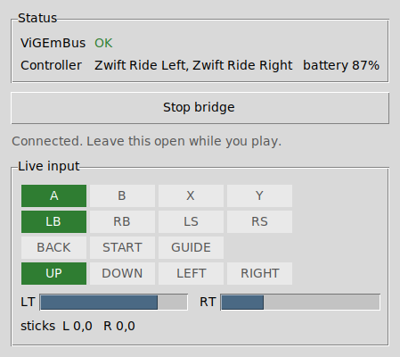
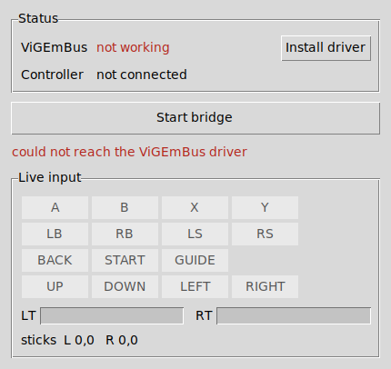
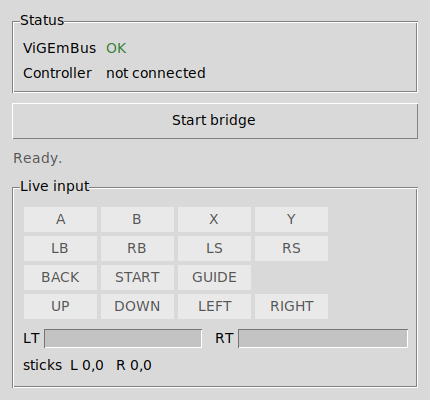

# RideController

Use a **Zwift Ride** controller as a **virtual Xbox gamepad** on Windows, so Steam
games see it as an ordinary controller.

The Zwift Ride talks a private Bluetooth LE protocol, not the standard HID
gamepad profile — Windows and Steam cannot use it directly, and no firmware
change can be made to it from the outside. RideController closes that gap on the
PC side: it connects to the controller over BLE, decodes its button and paddle
messages, and drives a virtual Xbox 360 pad through the
[ViGEmBus](https://github.com/nefarius/ViGEmBus) driver.

```
Zwift Ride  --BLE-->  RideController  --ViGEmBus-->  virtual Xbox 360 pad  -->  Steam
```

Steam treats that virtual pad exactly like real hardware, so Steam Input,
per-game bindings and controller glyphs all work normally.

## Requirements

- Windows 10 or 11
- Python 3.10 or newer — **not needed** if you use the `.exe`
- A Bluetooth LE adapter (built-in or USB)
- [ViGEmBus](https://github.com/nefarius/ViGEmBus/releases) — a source install
  pulls it in via `vgamepad`; with the `.exe`, run `install-driver` once
- A Zwift Ride controller **not currently connected to Zwift or the Zwift
  Companion app** (BLE controllers only talk to one host at a time)

## Install

### The executable — nothing else to install

Download `ridecontroller.exe` from the
[latest release](https://github.com/DBYoder/RideController/releases/latest),
put it anywhere, and run it from PowerShell:

```powershell
.\ridecontroller.exe doctor
```

No Python, no pip, no git — it is all bundled. Every command below works the
same way, as `.\ridecontroller.exe run` and so on.

You still need ViGEmBus. It is a kernel-mode driver, so it cannot live inside
an exe. Its installer *is* bundled, but nothing runs it for you — the source
installs get the driver as a side effect of `pip install`, and the exe never
runs that step. So install it once, first:

```powershell
.\ridecontroller.exe install-driver
```

Windows will ask for administrator permission, and may ask you to reboot.

Two other things to expect the first time. Windows SmartScreen will warn about
an unrecognised publisher, because the exe is not code-signed: choose **More
info** → **Run anyway**. And startup takes a second or two longer than the
installed version, since a single-file build unpacks itself to a temp
directory on each run.

### From source, without git

```powershell
irm https://raw.githubusercontent.com/DBYoder/RideController/HEAD/install.ps1 -OutFile install.ps1
powershell -ExecutionPolicy Bypass -File install.ps1
```

That checks for Python, downloads the project to `%USERPROFILE%\RideController`,
installs it and runs `ridecontroller doctor`. Use `-Path` to put it somewhere
else, and `-Force` to replace an existing install.

### From source, with git

```powershell
git clone https://github.com/DBYoder/RideController.git
cd RideController
py -m pip install -e .
```

Both source installs pull in `vgamepad`. If ViGEmBus is not installed yet, the
first run pops up its installer; reboot afterwards if it asks you to.

## The control panel

Double-click `ridecontroller.exe`, or run it with no arguments, and it opens a
window instead of printing usage:

```powershell
.\ridecontroller.exe gui
```



Buttons light up as you press them, and the triggers move with the brake
paddles. That is the quickest way to check a remap, or to find which physical
button produces which name — faster than reading `ridecontroller monitor`
scroll past.

Before the driver is installed it says so and offers to do it, rather than
leaving you to find out when nothing happens in-game:



And once the driver is in but no controller is connected yet:



Remapping still happens in the config file; the panel does not edit it yet.

## Quick start

```powershell
# 1. Check the environment, the driver and that the controller is visible
ridecontroller doctor

# 2. See what is nearby
ridecontroller scan

# 3. Verify the virtual pad works, without touching the controller
#    (Windows: open "Set up USB game controllers" and watch it move)
ridecontroller simulate

# 4. Watch real button presses decode, without creating a virtual pad
ridecontroller monitor

# 5. Run the bridge — leave this window open while you play
ridecontroller run
```

Start `ridecontroller run` **before** launching the game so Steam picks the pad
up at startup. Press `Ctrl+C` to stop; all buttons are released on exit.

If PowerShell answers `The term 'ridecontroller' is not recognized`, pip's
`Scripts` directory is not on your `PATH`. Everything above also works as
`py -m ridecontroller ...` — for example `py -m ridecontroller doctor`.

## Default mapping

| Zwift Ride input | Xbox output | Notes |
| --- | --- | --- |
| D-pad up/down/left/right | D-pad | Set `dpad_drives_left_stick` to also deflect the left stick, for games that read the stick and ignore the D-pad |
| A | A | |
| B | B | |
| Y | Y | |
| Z | X | |
| Left shift up | LB | |
| Left shift down | LS (stick click) | |
| Right shift up | RB | |
| Right shift down | RS (stick click) | |
| Left powerup | Back / View | |
| Right powerup | Start / Menu | |
| Left brake paddle (analog) | Left trigger | Analog, with a deadzone |
| Right brake paddle (analog) | Right trigger | Analog, with a deadzone |
| Left on/off | *unmapped* | Holding it sleeps the controller |
| Right on/off | Guide | Opens the Steam overlay |

`ridecontroller outputs` prints the live mapping and every valid output name.

## Configuration

```powershell
ridecontroller init-config     # writes %APPDATA%\RideController\config.toml
notepad %APPDATA%\RideController\config.toml
```

Everything in the file is optional — anything you leave out keeps its default.
Remap a button by naming an output:

```toml
[buttons]
z = "RSTICK_UP"          # any of: A B X Y LB RB LS RS BACK START GUIDE
powerup_left = "NONE"    # DPAD_* LT RT LSTICK_* RSTICK_* NONE

[analog.left_paddle]
output = "LSTICK_X"      # or LT / RT / LSTICK_Y / RSTICK_X / RSTICK_Y / NONE
deadzone = 15            # ignore paddle movement below this (raw units, 0-100)
full_scale = 80          # raw value treated as fully pressed — a shorter throw
invert = false
```

Use a different file with `ridecontroller --config path\to\config.toml run`, so
you can keep one profile per game.

## Steam notes

- The pad shows up as an **Xbox 360 Controller**. In Steam → Settings →
  Controller, leave "Xbox Extended Feature Support" alone; ViGEm needs nothing
  special.
- If a game ignores it, open Steam Input for that game and confirm the pad is
  detected; Big Picture usually finds it immediately.
- If a game reads the analog stick and ignores the D-pad, set
  `dpad_drives_left_stick = true` so the D-pad deflects the stick too. It is off
  by default because a game that reads *both* then counts every press twice.
- Steam sometimes only enumerates controllers present at launch. If the game
  cannot see the pad, start `ridecontroller run` first, then Steam.

## Troubleshooting

| Symptom | Fix |
| --- | --- |
| `No Zwift Ride controller found` | Press a button to wake the controller. Close Zwift and the Companion app — they hold the BLE connection. Try `ridecontroller scan --all`. |
| `no Zwift service found` | Update the controller firmware in the Zwift Companion app. |
| `could not create a virtual Xbox 360 pad` | Run `ridecontroller install-driver`, then reboot. Or install it by hand: <https://github.com/nefarius/ViGEmBus/releases> |
| `vgamepad cannot reach ViGEmBus` | Same thing — the driver is missing. `ridecontroller install-driver`. |
| Buttons land on the wrong outputs | Run `ridecontroller monitor` to see the input names, then remap them in the config. |
| Paddles feel half-scale or read negative | Set `analog_encoding = "varint"` under `[protocol]`. See [docs/PROTOCOL.md](docs/PROTOCOL.md). |
| Controller drops out mid-session | Reconnection is automatic (`device.reconnect`); check the battery with `--log-level debug`. |
| Nothing happens in-game | Confirm the pad itself works with `ridecontroller simulate`, then check Steam Input bindings. |

`--log-level debug` prints every raw BLE packet, which is the fastest way to see
what the controller is actually sending.

## How it works

| Module | Responsibility |
| --- | --- |
| `ridecontroller/ble.py` | Scanning, connection, the `RideOn` handshake, reconnection |
| `ridecontroller/protobuf.py` | A ~120-line protobuf wire reader (no codegen, no runtime dependency) |
| `ridecontroller/protocol.py` | Zwift message decoding → `ControllerInput` snapshots |
| `ridecontroller/mapping.py` | `ControllerInput` → `OutputState` (buttons, triggers, sticks) |
| `ridecontroller/outputs/` | `xbox360` (ViGEmBus via vgamepad) and `debug` backends |
| `ridecontroller/bridge.py` | Merges both controller halves and pushes state to a backend |
| `ridecontroller/config.py` | TOML config, validation, the annotated starter file |
| `ridecontroller/cli.py` | `scan`, `monitor`, `run`, `simulate`, `doctor`, … |
| `ridecontroller/gui.py` | The Tkinter control panel |
| `ridecontroller/driver.py` | Finding and running the bundled ViGEmBus installer |

The controller pushes complete state snapshots rather than press/release events,
so the bridge is stateless: decode → merge → map → apply. If one half of the
controller disconnects, only its buttons are released.

The protocol itself is documented in [docs/PROTOCOL.md](docs/PROTOCOL.md).

## Development

```bash
pip install -e ".[dev]"
pytest
```

The tests cover the wire format, the message decoding (including the active-low
button mask), the mapping engine, the config loader, the CLI, and the connection
state machine against a fake BLE backend — so everything except the ViGEmBus
call itself runs without hardware. Use `--backend debug` to run the bridge on a
machine with no virtual-gamepad driver.

### Building the executable

```powershell
py -m pip install pyinstaller
pyinstaller --noconfirm --clean packaging/ridecontroller.spec
```

The result is `dist\ridecontroller.exe`. PyInstaller does not cross-compile, so
this has to run on Windows; `.github/workflows/build-exe.yml` does it on a
`windows-latest` runner for every push, and attaches the exe to the release
when a `v*` tag is pushed.

The spec collects `vgamepad`'s package data explicitly, because ViGEmClient.dll
ships inside that package — miss it and the exe builds fine but cannot create a
pad. `bleak` needs no such handling; it provides its own PyInstaller hooks.

## Not included

- Zwift Play and Zwift Click. They speak the same protocol with a different
  button layout; `accept_any_zwift_device = true` will connect, but the mapping
  is not written for them.
- Haptics — the Ride can buzz, but nothing here sends the command.
- Keyboard/mouse emulation.
- A code-signed executable. The `.exe` is unsigned, so SmartScreen warns the
  first time you run it.

## Credits

The protocol is not published by Zwift. This implementation is written from
public reverse-engineering write-ups — chiefly
[ajchellew/zwiftplay](https://github.com/ajchellew/zwiftplay), the
[Makinolo](https://www.makinolo.com/blog/2024/07/26/zwift-ride-protocol/)
protocol posts, and [OpenBikeControl/SwiftControl](https://github.com/jonasbark/swiftcontrol).
No code from those projects is used here.

Not affiliated with or endorsed by Zwift. "Zwift" and "Zwift Ride" are
trademarks of Zwift, Inc.

## License

MIT — see [LICENSE](LICENSE).
